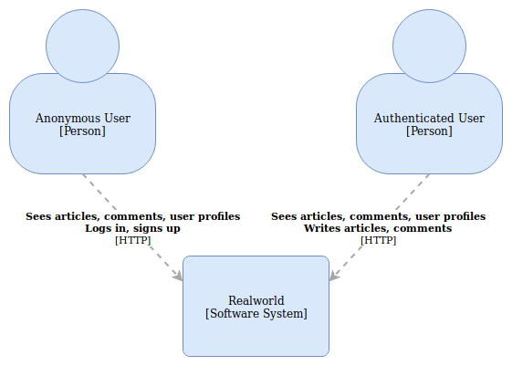
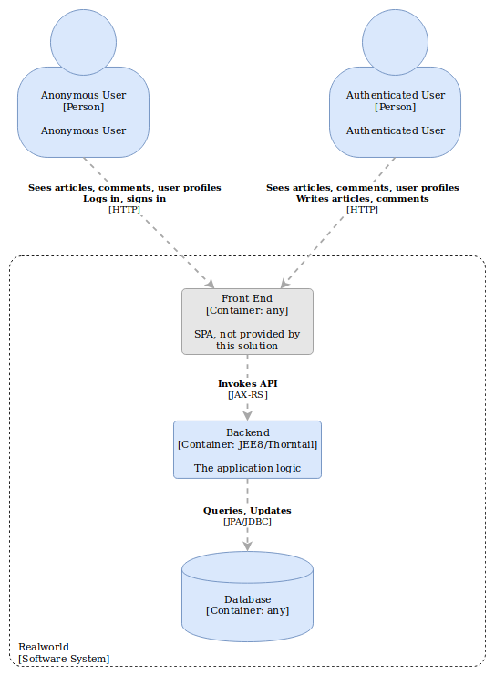
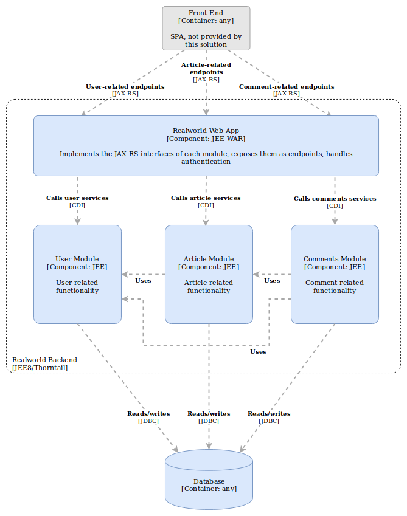
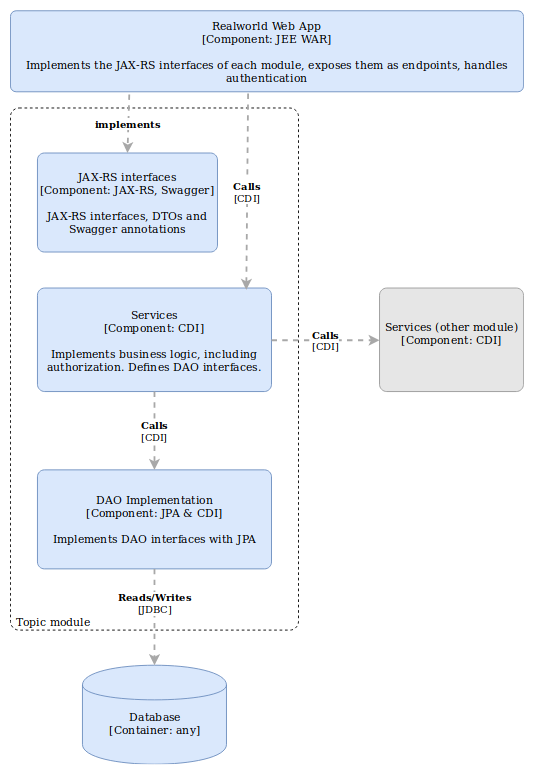

# Architecture

## Introduction

The `realworld-jee-thorntail` demonstrates a simple implementation of the Realworld API using JEE and [Thorntail](https://thorntail.io/).
It tries to use the standard JEE APIs and general best practices as much as possible.
The overall architecture is quite traditional, in an effort to keep it as simple and comprehensive as possible.

A goal is to be able to use this implementation as a baseline to experiment with more modern techniques and practices.
So, the design has been done with arhitectural extensibility in mind.
E.g. the three topic domains of the application, users, articles, and comments, are placed in their own autonomous modules.
And, despite the fact that they use a single DB and a single container web application in the current implementation,
it shouldn't be too difficult e.g. to split them in truly autonomous microservices.

A high-level view of the application context (as described by the [C4 model](https://c4model.com/)) is:

Anonymous users see articles, comments on the articles and user profiles.
They can login or sign up at any time to become authenticated users.
Authenticated users can author articles and comments, in addition to the capabilities of anonymous ones.
Moreover they can follow other users and "like" articles.

## Containers

The application consists of a single deployable unit besides the database.
It is packaged as a single, runnable JAR, containing the application server runtime.

The Maven module `realworld-jee-thorntail` (under the directory `realworld-jee-thorntail-deployments`) is responsible
for assembling the Thorntail JAR, and implementing the web-related aspects of the application.

The database schema and any migrations will run through Liquibase.
Each topic domain, users, articles, and comments, has its own Maven module that is responsible for migrations,
e.g. `realworld-jee-thorntail-article-migrations` for the article topic domain.

## Modules

The hierarchy of Maven modules, that also depicts the logical relationships between application modules, is the following.

- Root module `realworld-jee-thorntail-parent`
	- `realworld-jee-thorntail-common`: Container of modules implementing common functionalities
		- `realworld-jee-thorntail-common-jpa`: Common JPA functionality to be used potentially by any JPA implementation.
		Could contain common JPA-specific services usable by DAOs, `AttributeConverter`, etc; for the time being it only
		contains a CDI producer for the `EntityManager`.
		- `realworld-jee-thorntail-common-services`: Generic services and code that can potentially be reused by any other module
		- `realworld-jee-thorntail-services-auth`: Generic authentication and authorization services
	- `realworld-jee-thorntail-deployments`: Contains modules for any deployable unit created for this application
		- `realworld-jee-thorntail`: The Realworld Web App is the main and only deployable of this application
	- `realworld-jee-thorntail-article-module` (see below)
	- `realworld-jee-thorntail-comments-module` (see below)
	- `realworld-jee-thorntail-user-module`: POM containers for each topic domain of the application. Their structure is common:
		- `realworld-jee-thorntail-xxx-model`: Data objects and interfaces used to describe this domain
		- `realworld-jee-thorntail-xxx-services`: Business logic, DAO interfaces
		- `realworld-jee-thorntail-xxx-jpa`: DAO implementation using JPA
		- `realworld-jee-thorntail-xxx-jaxrs`: JAX-RS interfaces and DTOs: creating a Java JAX-RS client for this module
		would require dependency only to this and the `-model` modules.
		- `realworld-jee-thorntail-xxx-migrations`: Liquibase (DB migrations)

Zooming into the containers diagram, we identify the following high-level components:

Within each topic (articles, comments, users) module, the relationships of the various JARs are as follows;
the organization closely follows the terms of "Ports and Adapters" architecture or ["Hexagonal Architecture"](https://fideloper.com/hexagonal-architecture).

The `realworld-jee-thorntail-xxx-jaxrs` defines interfaces annotated with JAX-RS and Swagger annotations.
This JAR can be used to create a Java client for the respective services it defines.
JAX-RS can be seen as a "Port" to the application and does not exclude other possible ports.

The web application assembles all modules and implements the JAX-RS interfaces.
The implementations are responsible only for translating the web calls to and from Java code.
They delegate all logic to the services that are injected into them.
It can be seen as an "Adapter" for the JSON RPC "Port" (the Realworld API does not qualify for REST in the pure sense of the term).

The services implement the main business logic of the application.
Ideally they are agnostic of the environment they are running, i.e. no servlet-specific dependencies, no `@RequestScoped`
or `@SessionScoped` annotations.
The DAO interfaces are defined in this module.
In terms of Hexagonal Architecture, this is the "Domain Model".

Finally the current DAO implementation uses JPA to adapt a relational database and expose itself through CDI to the service layer.

All modules use the `realworld-jee-thorntail-xxx-model` JAR (not shown below for simplicity), as a common model to communicate.
The model defines validation rules on its objects using Java Bean Validations.

# Design

## Principles

1. Simplicity, with the goal to ease implementation and, most important, maintenance;
note that simplicity does not always mean less lines of code, rather clearer code that respects the separation of concerns
2. Make reasoning about the system as easy as possible; small manageable units of code, clear separation of concerns,
both in class design and module design
3. Testability
4. Programming through interfaces

More principles apply to specific areas of the application:

### DAOs

1. Single point of truth: no caching, asks the underlying store every time; caching, if needed, should be applied by layers on top of it
	- Rationale: Whenever an invocation reaches this layer we know that data is fresh from the DB and a query is executed.
2. Objects returned should be unconnected: any change made to them should not be reflected to the database, ideally the returned objects should be immutable
	- Rationale: Makes data flows explicit, i.e. you need to call the DAO layer to save or modify an object. The permanent state can only be altered in a single place, the DAO layer.
3. Does not know of business terms ("business agnostic"), unless a business term is explicitly declared in the data store
	- Rationale: Keep business logic and persistence logic separate, separation of concerns
	- Example: Imagine that we introduce the concept of the "esteemed user" as "a user having _number_of_authored_articles_ + _number_of_followers_ >= 1000".
	If the choice is to implement it as a flag in the database, then having a method `isUserEsteemed(user)`, executing a query like
	`SELECT u.esteemed FROM User u WHERE u.username=?` would be appropriate because there is a column named `esteemed` in the database.
	On the other hand, if it is decided that such a flag will not be maintained in the DB, then the term "esteemed" should not appear in the DAO layer.
	Instead a method like `countArticlesAndFollowers(user)` could be implemented in the DAO.
	The actual "esteemed" user threshold (here 1000) would live as configuration in the business logic layer, where `isEsteemed(user)`
	could be implemented as `return dao.countArticlesAndFollowers(user) >= config.getEsteemedThreshold()`.

Principle (1) above can be realized by striving to keep the DAOs as pure as possible.
Pure, in the strict functional programming sense, is not applicable to DAO methods as they will always have either
a side-effect, when writing to the database, or indirect input, when reading from it, or both.
But DAO methods can be considered as pure, if we allow ourselves to think of the database as another, generalized
input/output of the function, besides its arguments and its return value.

#### Responsibilities

1. Translate DB query results to unconnected Java objects
2. Translate method calls to queries
3. Translate exceptions specific to the underlying technologies to something meaningful for the rest of the application

### Business logic

1. Implementation of the core/business logic of this application
2. Authorization logic
3. Transaction demarcation
4. Data validation (although constraints are defined in the model)
5. Orchestrating calls to the DAO layer
6. Translating exceptions might be needed: when a third-party library used throws an exception, translate it to an application-specific exception, so as not to couple the application with that specific third-party library

## Authentication

The Realworld API requires that users authenticate through a JWT and specifies how to acquire it.

In general, and to adhere to the "Ports and Adapters" architecture, authentication is a responsibility of each port.
As such, each port that implements a communication protocol, must extract user authentication data from structures
specific to that protocol, create an implementation of the `realworld.authentication.User` interface and expose it
to the rest of the application through the `realworld.authentication.AuthenticationContext`.
The latter is implemented by a CDI Bean and can be injected to any service that requires it.

We refrain from injecting the `AuthenticationContext` directly to DAOs, to keep them pure,
in the widened sense of the term described above.
Instead we include the user as argument to DAO methods and let the services determine its value.

## Authorization

Authorization is implemented by exploiting the CDI Decorators.
The CDI spec describes decorators as:

> [...]superficially similar to interceptors, but because they directly implement operations
> with business semantics, they are able to implement business logic[...]

This makes them ideal for implementing authorization, an operation that is an essential part of the business logic.
And as such, they are located in the service modules.

Every service interface is implemented twice, once for the core business logic and once for the respective
authorization logic in a decorator.
The authorization logic must be kept crystal clear and understandable so as to limit security risks such as
information disclosure or privilege escalation.
The pattern used is to implement the autonomous bits of the authorization logic into "authorization objects".
There is the common `realworld.authorization.Authorization` that contains generic authorization logic,
such as the `requireLogin()` method.
Any module that needs to implement specialized authorization logic, defines its own authorization object,
e.g. the `realworld.article.services.ArticleAuthorization` with its `requireCurrentUserToBeAuthorOf()` method.
Then authorization can be implemented in a straightforward way in the decorator method, e.g. for deleting an article:

	@Decorator
	@Priority(APPLICATION)
	class ArticleServiceAuthorizer implements ArticleService {
		public void delete(String slug) {
			articleAuthorization.requireCurrentUserToBeAuthorOf(slug);
			delegate.delete(slug);
		}
	}

## Build customization

JDBC and JPA abstract the database specifics, making it easy to switch to different databases.
The build tries to make use of this capability.
Although implemented only for H2, the database selection can be done through Maven profiles.
Profiles are implemented at three levels:

- At the parent pom: Defines the version of the DB driver and build properties to configure the datasource in Thorntail
- At the WAR project: Actually contains the driver to be included in the final deployable
- At each migration project: So that Liquibase knows to which DB to connect

The build and runtime need more properties to specify the DB connection (URL, username, password).
These are provided to the build by Maven properties (either at the command line or as another profile in `settings.xml`).
They can be overridden for the runtime using `-Dxxx=yyy` arguments when running the jar, or using extra Thorntail
configuration yaml files.
